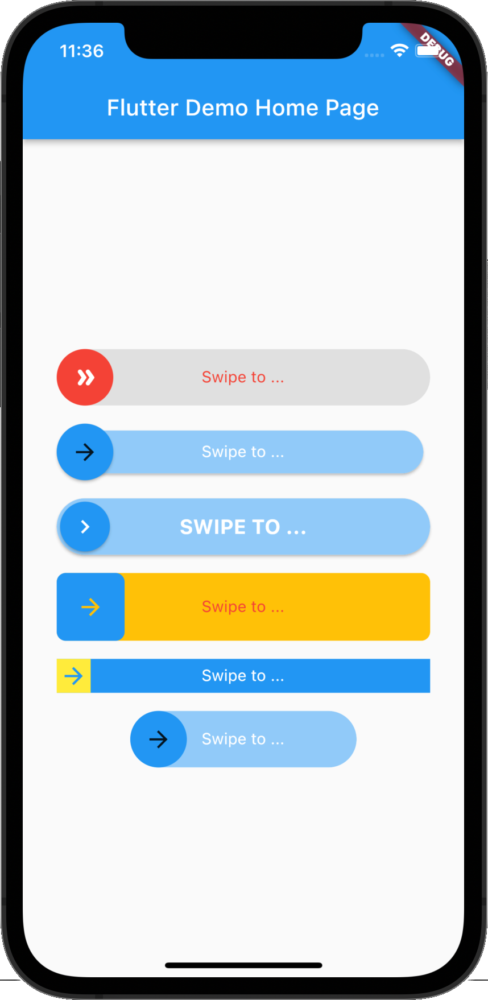
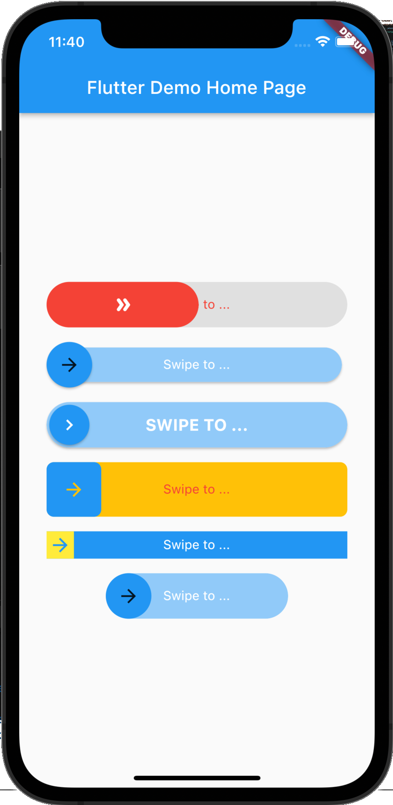
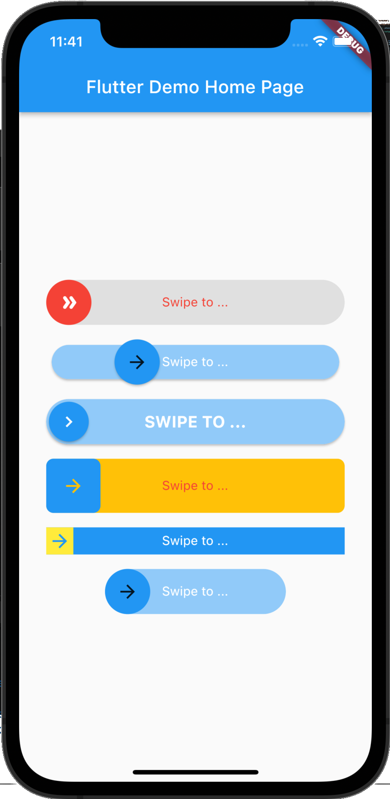

# flutter_swipe_button

[](https://pub.dev/packages/flutter_swipe_button)
[](https://opensource.org/licenses/MIT)

Avoid accidental clicks or dialogs to prevent them using SwipeButton.

## Screenshot

|              Example 1          |              Example 2          |              Example 3          |
| :-----------------------------: | :----------------------------:  | :-----------------------------: |
|  |  |  |

## Getting Started

### Adding package

```yaml
flutter_swipe_button: ^2.1.1+1
```

### Importing package

```yaml
import 'package:flutter_swipe_button/flutter_swipe_button.dart';
```

## How to use

```dart
SwipeButton.expand(
  thumb: Icon(
    Icons.double_arrow_rounded,
    color: Colors.white,
  ),
  child: Text(
    "Swipe to ...",
    style: TextStyle(
      color: Colors.red,
    ),
  ),
  activeThumbColor: Colors.red,
  activeTrackColor: Colors.grey.shade300,
  onSwipe: () {
    ScaffoldMessenger.of(context).showSnackBar(
      SnackBar(
        content: Text("Swipped"),
        backgroundColor: Colors.green,
      ),
    );
  },
)

```

```dart
SwipeButton(
  trackPadding: EdgeInsets.all(6),
  elevationThumb: 2,
  child: Text(
    "Swipe to ...",
    style: TextStyle(
      color: Colors.white,
    ),
  ),
  onSwipe: () {
    ScaffoldMessenger.of(context).showSnackBar(
      SnackBar(
        content: Text("Swipped"),
        backgroundColor: Colors.green,
      ),
    );
  },
)

```

```dart
SwipeButton(
  thumbPadding: EdgeInsets.all(3),
  thumb: Icon(
    Icons.chevron_right,
    color: Colors.white,
  ),
  elevationThumb: 2,
  elevationTrack: 2,
  child: Text(
    "Swipe to ...".toUpperCase(),
    style: TextStyle(
      color: Colors.white,
      fontSize: 18,
      fontWeight: FontWeight.bold,
    ),
  ),
  onSwipe: () {
    ScaffoldMessenger.of(context).showSnackBar(
      SnackBar(
        content: Text("Swipped"),
        backgroundColor: Colors.green,
      ),
    );
  },
)

```

```dart
SwipeButton(
  borderRadius: BorderRadius.circular(8),
  activeTrackColor: Colors.amber,
  height: 60,
  child: Text(
    "Swipe to ...",
    style: TextStyle(
      color: Colors.red,
    ),
  ),
  onSwipe: () {
    ScaffoldMessenger.of(context).showSnackBar(
      SnackBar(
        content: Text("Swipped"),
        backgroundColor: Colors.green,
      ),
    );
  },
)

```

```dart
SwipeButton(
  activeTrackColor: Colors.blue,
  activeThumbColor: Colors.yellow,
  borderRadius: BorderRadius.zero,
  height: 30,
  child: Text(
    "Swipe to ...",
    style: TextStyle(
      color: Colors.white,
    ),
  ),
  onSwipe: () {
    ScaffoldMessenger.of(context).showSnackBar(
      SnackBar(
        content: Text("Swipped"),
        backgroundColor: Colors.green,
      ),
    );
  },
)

```

```dart
SwipeButton(
  width: 200,
  child: Text(
    "Swipe to ...",
    style: TextStyle(
      color: Colors.white,
    ),
  ),
  onSwipe: () {
    ScaffoldMessenger.of(context).showSnackBar(
      SnackBar(
        content: Text("Swipped"),
        backgroundColor: Colors.green,
      ),
    );
  },
)

```

## License

  MIT License
